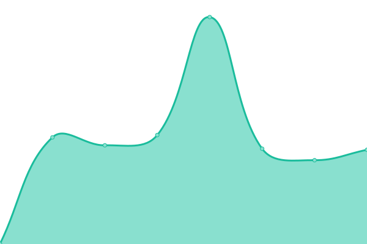

# [📈 Live Status](https://demo.upptime.js.org): <!--live status--> **🟩 All systems operational**

This repository contains the open-source uptime monitor and status page for [Upptime](https://upptime.js.org), powered by [Upptime](https://github.com/upptime/upptime).

With [Upptime](https://upptime.js.org), you can get your own unlimited and free uptime monitor and status page, powered entirely by a GitHub repository. We use [Issues](https://github.com/upptime/upptime/issues) as incident reports, [Actions](https://github.com/lsy223622/status/actions) as uptime monitors, and [Pages](https://demo.upptime.js.org) for the status page.

<!--start: status pages-->
<!-- This summary is generated by Upptime (https://github.com/upptime/upptime) -->
<!-- Do not edit this manually, your changes will be overwritten -->
<!-- prettier-ignore -->
| URL | Status | History | Response Time | Uptime |
| --- | ------ | ------- | ------------- | ------ |
|  [lsy223622.com](https://lsy223622.com) | 🟩 Up | [lsy223622-com.yml](https://github.com/lsy223622/status/commits/HEAD/history/lsy223622-com.yml) | 

 820ms
     
 | 

<a href="https://status.lsy223622.com/history/lsy223622-com">93.01%</a>
    

|  [SoHard Cloud](https://cloud.lsy223622.com) | 🟩 Up | [so-hard-cloud.yml](https://github.com/lsy223622/status/commits/HEAD/history/so-hard-cloud.yml) | 

 1908ms
     
 | 

<a href="https://status.lsy223622.com/history/so-hard-cloud">93.01%</a>
    

|  [API](https://api.lsy223622.com/api-test.php) | 🟩 Up | [api.yml](https://github.com/lsy223622/status/commits/HEAD/history/api.yml) | 

 834ms
     
 | 

<a href="https://status.lsy223622.com/history/api">93.02%</a>
    

|  Main Server DERP | 🟩 Up | [main-server-derp.yml](https://github.com/lsy223622/status/commits/HEAD/history/main-server-derp.yml) | 

 949ms
     
 | 

<a href="https://status.lsy223622.com/history/main-server-derp">93.16%</a>
    

|  DERP Server DERP | 🟩 Up | [derp-server-derp.yml](https://github.com/lsy223622/status/commits/HEAD/history/derp-server-derp.yml) | 

 780ms
     
 | 

<a href="https://status.lsy223622.com/history/derp-server-derp">93.17%</a>
    

<!--end: status pages-->

[**Visit our status website →**](https://demo.upptime.js.org)

## 📄 License

- Powered by: [Upptime](https://github.com/upptime/upptime)
- Code: [MIT](./LICENSE) © [Upptime](https://upptime.js.org)
- Data in the `./history` directory: [Open Database License](https://opendatacommons.org/licenses/odbl/1-0/)
